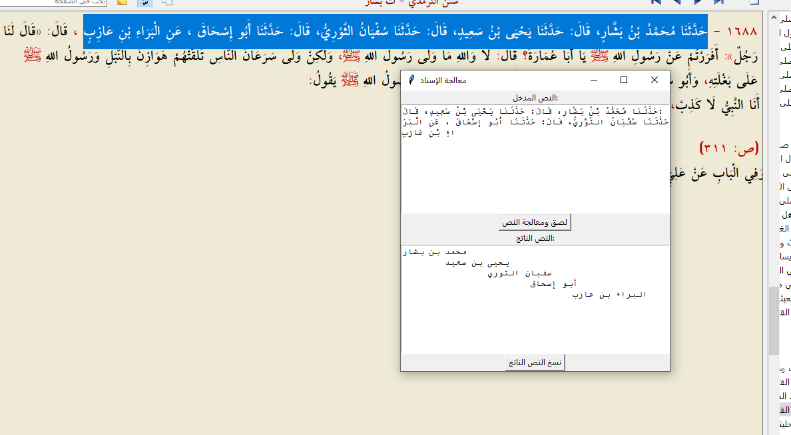
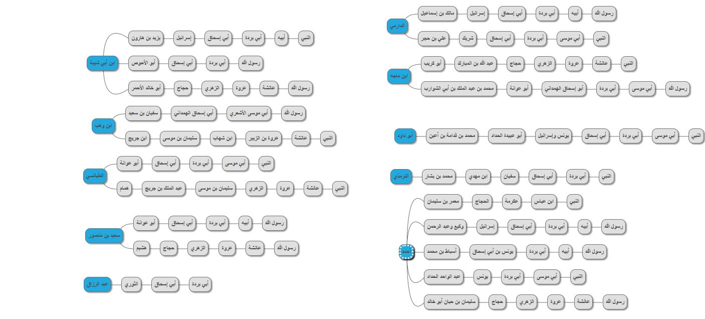

<h2> برنامج لاستخراج أسماء الرواة من الإسناد </h2>

برنامج بسيط مصمم بلغة بايثون وواجهة رسومية من مكتبة Tkinter

وظيفة البرنامج عزل أسماء الرواة عن في صيغ التحديث كـ حدثني عن قال...
والهدف من ذلك تشجير الإسناد من خلال موقع 
<h3><a herf="https://app.mindmup.com/">mindmup</a></h3>

<h2>طريقة الاستخدام</h2>

<h4>
 انسخ الإسناد من المكتبة الشاملة وضعه في البرنامج من خلال زر اللصق
</h4>

<h4>
انسخ النص الخارج من خلال زر النسخ، ثم الصقه بctrl v في عنصر اسم المصنف في موقع mindmup
</h4>

<h4>
تجربة عملية في استخدامه لتشجير بعض طرق حديث لا نكاح إلا بولي
</h4>
 

